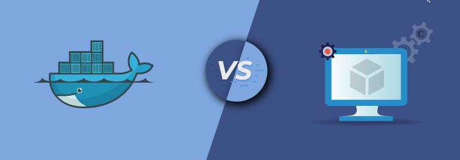
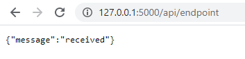
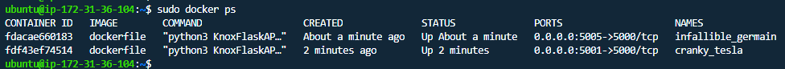
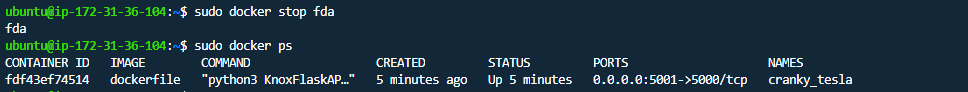
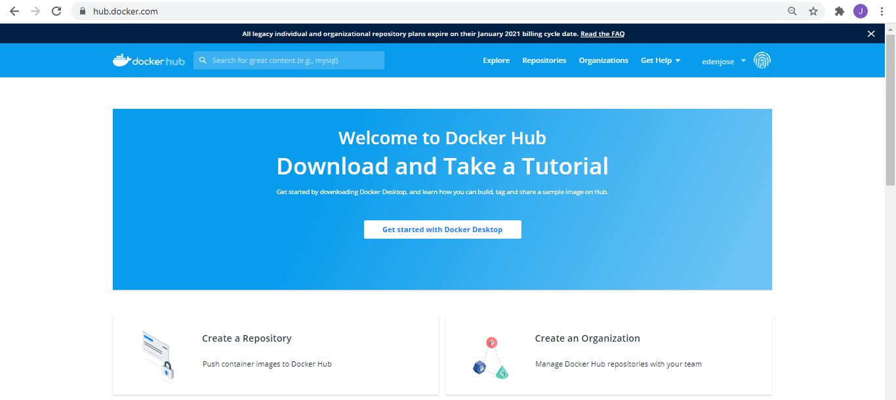
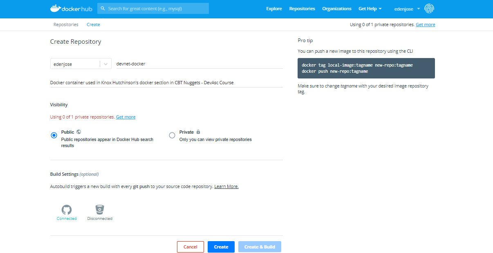

<!-- 2021-01-14 13:21:14 -->

# 26 - Docker #
______________________________________________________________

## VIRTUAL MACHINES vs. CONTAINERS ##

<p align="center">
    
</p>

<dl>
  <dt>Virtual machine Deployment</dt>
  <dd>Virtualizing the hardware. <br>
  We can have a single physical server where can install multiple VMs with different OS. </dd>

  <dt>Container-based Implementation</dt>
  <dd>Virtualizing the operating system.<br>
    Lightweight deployment<br>
    No need to install OS on containers. The containers share the kernel of the underlying OS, you just need to install the additional packages or dependencies of the application that you'll be 'containing'.</dd>
</dl>           

*************************************************************
## DOCKER ##

Tool used to manage containers. Provides a simple CLI with docker commands that allow us to interact directly
to all our containers. We can build our own containers from scratch using a DOCKERFILE.
______________________________________________________________

## INSTALLING DOCKER - UBUNTU ##

You can either use a virtual machine running in VirtualBox or VMware Workstation and run Docker from there.

You can also spin up an instance in the cloud and utilize the
available Ubuntu image. For this, you can opt for any cloud providers, sign-up for a free tier, and begin with the lab.

The set of steps below were used in Knox Hutchinson's Docker Section in the CBT Nuggets - DevAsc course. You can find the install script here

    https://github.com/DataKnox/CodeSamples/blob/master/Python/Docker/install.sh
______________________________________________________________

Uninstall old instances of old docker in the machine:
    
    sudo apt-get remove docker docker-engine docker.io containerd runc

Updates all repositories:

    sudo apt-get update

Install dependencies that docker requires:

    sudo apt-get install -y \
        apt-transport-https \
        ca-certificates \
        curl \
        gnupg-agent \
        software-properties-common

Download docker repo. 

    curl -fsSL https://download.docker.com/linux/ubuntu/gpg | sudo apt-key add 

Use the following to verify the add succeeded.
<!-- sudo apt-key fingerprint 0EBFCD88 -->
Adds repository - getting the latest release.

    sudo add-apt-repository \
        "deb [arch=amd64] https://download.docker.com/linux/ubuntu \
        $(lsb_release -cs) \
        stable"

Update the database again.

    sudo apt-get update

Finaly, install docker.

    sudo apt-get install -y docker-ce docker-ce-cli containerd.io

To test if docker is running, we can pull a docker image from dockerhub and run it.

    sudo docker run -it --rm --name nyancat 06kellyjac/nyancat

You should be seeing the gif of a 'nyancat'.


______________________________________________________________

## CONTAINERIZE YOUR APP WITH A DOCKERFILE ##

Begin first by installing the Docker extension by Microsoft in your VSCode. Once you've installed the extension, you can go to this link to check out Knox's code sample for a flask API [here](https://github.com/DataKnox/CodeSamples/blob/master/Python/Docker/myAPI/myAPI.py)

I used the same code and created 'KnoxFlaskAPI.py':

```python
from flask import Flask, jsonify

app = Flask(__name__)

@app.route('/api/endpoint', methods=['GET'])
def get_data():
    return (jsonify({'message': 'received'}), 200)


if __name__ == '__main__':
    app.run(host='0.0.0.0')
```

Note that you'll need to install flask in a python virtual environment before you can run this code. You can read the
full tutorial [here](https://code.visualstudio.com/docs/python/tutorial-flask)

After you've installed flask, run the code:
```python
python KnoxFlaskAPI.py
```

You should be seeing it return an output like this:

```python
$ python KnoxFlaskAPI.py 
* Serving Flask app "KnoxFlaskAPI" (lazy loading)
* Environment: production
WARNING: This is a development server. Do not use it in a production deployment.
Use a production WSGI server instead.
* Debug mode: off
* Running on http://0.0.0.0:5000/ (Press CTRL+C to quit)
```

Now go to your browser and enter the link below.
Note that the port '5000' was from the output when we run the program while the '/api/endpoint' was specified in the code.

    127.0.0.1:5000/api/endpoint

You should be seeing something like this:




Now our next goal is to containerize this application.
Start with installing the DOcker extension in VS Code.
Next, on the same folder where the code is, create a file named 'Dockerfile'

## What is a Dockerfile? ##

This works basically like a shell script where a series of commands is identified, and this commands will be used to build our docker container. <br>

1. **Specify OS and Maintainer in the Dockerfile**
    Open the Docker file and enter the first line. Note that you'll substitute the OS with the Linux OS you are using.

    Here we're telling it what base operating system to use

    ```docker
    FROM ubuntu:18.04
    ```
    
    You can set a maintainer - you can put your name and email address here

    ```docker
    MAINTAINER Eden Jose "eden.noel@yahoo.com"
    ```
    <br>

2. **Update the OS**
    Make sure that the base OS is up to date. We will also need to make sure python is installed.

    ```docker
    RUN apt-get update -y && apt-get install -y python3-pip python3-dev
    ```

    Note here that we begin the command with ***RUN*** - this is used when the command is known to the OS. In this case, the apt command is a native of Ubuntu.

    For raw commands unknown to the operating system, we use the ***CMD []*** commands. Inside the [], we specify the commands and the parameters.

    For our application, our flask API is going to be listening to port 5000, so traffic must also be allowed in the same port number in the container.

    ```docker
    CMD ["ufw allow 5000]
    ```
    <br>
3.  **Install flask with the correct version on the container**
    We first need to create a ***requirements.txt*** which will contain the flask version of the Linux machine. Go to the terminal and run the command below.
    
    ```bash
    sudo pip3 freeze > requirements.txt
    ```
    This will list down all the libraries available by pip and then write it into ***requirements.txt***
    The text file should contain something like this.

    ```bash
    $ cat requirements.txt 
    asn1crypto==0.24.0
    click==7.1.2
    cryptography==2.1.4
    enum34==1.1.6
    Flask==1.1.2
    ```

    We now have to delete everything else in this list except for flask.

    ```bash
    $ vi requirements.txt
    $ cat requirements.txt
    Flask==1.1.2
    ```

    Note that this requirements.txt exists only in the Linux machine, not on the container yet.

    Going back to the Dockerfile, add the command below.
    Here we're copying the requirements.txt onto the app folder in the container.

    ```docker
    COPY ./requirements.txt /app/requirements.txt
    ```

    We then change the path to the app folder inside the container and make this the working directory.
    
    ```docker
    WORKDIR /app
    ```
    
    We then use the ***RUN*** command again to install the flask version indicated in the ***requirements.txt***

    ```docker
    RUN pip install -r requirements.txt
    ```
    <br>
4.  **Copy the flask app from the Linux machine onto the /app folder in the container.**
    To do this, we will need to run the line below.
    At this point, everything is setup. The only thing to do after copying the file is to start the API.

    ```docker
    COPY ./KnoxFlaskAPI.py /app
    ```
    <br>
5.  **Start the API**
    We need to specify the program we want to execute. Here we're using python3 as the program.

    ```docker
    ENTRYPOINT ["python3"]
    ```
    We then specify the parameters to be passed to the python program.

        CMD ["KnoxFlaskAPI.py"]
    <br>

Your complete Dockerfile should look like this:

```docker
    
FROM ubuntu:18.04

MAINTAINER Eden Jose "eden.noel@yahoo.com"

RUN apt-get update -y && apt-get install -y python3-pip python3-dev

CMD ["ufw allow 5000]

COPY ./requirements.txt /app/requirements.txt

WORKDIR /app

RUN pip3 install -r requirements.txt

COPY ./KnoxFlaskAPI.py /app

ENTRYPOINT ["python3"]

CMD ["KnoxFlaskAPI.py"]

```
______________________________________________________________

**WORKING WITH DOCKER COMMANDS**

We can now begin building the docker container using the Dockerfile.

```bash
sudo docker build -t dockerfile:latest .
```

This will return a bunch of output as it runs all the steps in the Dockerfile. Once this is done, you can test by checking the docker images

```bash
sudo docker images
```

It should return something like this:

```bash
REPOSITORY   TAG       IMAGE ID       CREATED          SIZE
dockerfile   latest    67cf1bce86fd   39 seconds ago   496MB
ubuntu       18.04     2c047404e52d   7 weeks ago      63.3MB
```

Next step is to run the docker container. Note the different flags we have in the command below. 

<dl>
<dd>'-d' detach <br>
This tells the program that we dont want it to actually enter the docker instance.</dd>

<dd>'-p' port-forwarding <br>
This tells the Linux machine that if it receives a traffic, forward it directly to the port 5000 of the container we are running.</dd>
</dl>

Note that for scenarios where you have multiple container running on a single host, all traffic is received on the host's ip and you need to carefully check that you're forwarding the specific traffic to the appropriate port of each container.

```bash
sudo docker run -d -p 5001:5000 dockerfile
```

To check the running containers

```bash
sudo docker ps
```

This would return an output like this:



To stop a container:

```bash
sudo docker stop <name or ID>
```

Checking back the running containers after stopping one container:



To remove a container:

```bash
sudo docker  container rm <container name>
```
_________________________________________________________

## PUSHING AND PULLING WITH DOCKERHUB ##

After containerizing our application, we can now deploy our application to dockerhub. Go to hub.docker.com and sign-up for an account. You should also be able to link your Github account to it. 

Once you have your account setup, create a repository.





<br>
Going back to your terminal, stop the running containers first

```bash
sudo docker ps
sudo docker stop <container ID>
```

Login to your dockerhub account

```bash
sudo docker login --username=admin
```

Tag the container that you want to push to your dockerhub repo
with your dockerhub username/repo-name

```bash
sudo docker images
sudo docker tag <image ID> <username/repo-name>:latest
```

Now that it's prep-up, you're ready to push it to your dockerhub repo.

```bash
sudo docker push <username/repo-name>
```

## What's the purpose of having a copy of the container in a remote repository? ##

Let's say you deleted the container in your machine. You can easily pull the container image from the dockerhub repo.

Let's try removing our container image.

```bash
sudo docker images
sudo docker rmi <image id> -f
sudo docker images
```

Now let's try pulling the same image form our dockerhub repo.

```bash
sudo docker pull <username/repo-name>:latest
sudo docker images
```


