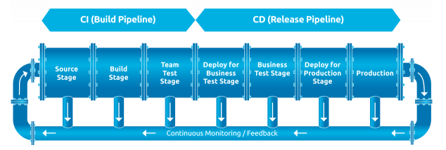
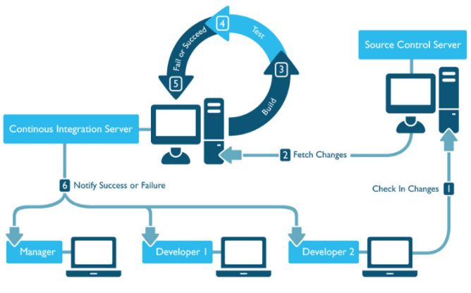

# 27 - CICD Pipeline #
_____________________________________________________

## CICD ##

This is the practice of **Continuous Integration and Continuous Deployment** - constantly updating your software and integrating and rolling out as frequently as possible.

This shortens time between the development of feature or a fix and going live to production.

This is based on the belief that deployment of software should be easy and available on demand. This helps to produce high quality software with lower costs and shorter time to deployment. This is something that need to be planned and architected.
_______________________________________________________

## CONTINUOUS INTEGRATION ##

Automating the combination of code changes from multiple contributors into a single code base.

Let's say you are working with a team, and you are all working on a single codebase simultaneously. As each member updates the code, there could be a tendency for one change to conflict with another's change.

This is where CI comes in. The faster you can resolve the conflicts, merge and integrate everyone's code, and test it, the better the code output will be.

It is also possible that you're only person working on the code and you need to merge your changes with the code you last updated a couple months ago.
_______________________________________________________

**COMPONENTS OF CONTINOUS INTEGRATION**

1. **Source Code Control**

    Version control system. By checking in your code into a good version control system like Git, you can start off the whole process.
     

2. **Build Automation**
    Automatic compilation of your code. Anything that is needed to build your software should happen automatically once code changes are checked in.
     

3. **Unit Testing**
    Automatic testing of the individual components of your code. You can look into the practice of *TDD* or *Test-Driven Development*.
     

4. **Branch Merging**
    This is where your source control merges all the code changes to set you up for integration testing.
     

5. **Integration Testing**
    This is the second test. This is where the individual components are tested to see if they work together smoothly.
_______________________________________________________

## CONTINUOUS DEPLOYMENT/DELIVERY ##

Automating the delivery of IT services to users.
This may mean delivering code to your users or more specifically, copying to a servers on different locations which will serve the software to your users.

This could also be deploying the code on a test environment, not just the production environment.

_______________________________________________________

**COMPONENTS OF CONTINUOUS DELIVERY/DEPLOYMENT**

1.  **Central Repository**
    Sending the code your private github repository or to a local git server.
     

2.  **System Testing**
    Automated testing. Ensuring your code has access to different systems and that it can communicate to them.
     

3.  **Deployment**
    Actual deployment.  
     

4.  **User-Acceptance testing**
    Having users test to see if software works as expected.
_______________________________________________________

## INTEGRATION, BUILDING, AND TESTING ##

The first point is to commit to source control. This 'kicks off' the CICD Pipeline. We want to automate everything as uch as possible.

**MAINTAIN A SINGLE REPOSITORY**
A thing that we want to consider is to maintain a single source repository as much as possible. Having multiple source repositories can cause confusion and a better way to work on multiple versions of a codebase is by leveraging the **branching** feature of git.

Beside maintaining a single code base, we must also maintain a single set of:

- test scripts
- database schema files
- 3rd-party libraries

Once your code is checked in the source control management, your next step is to automate the build process.

**AUTOMATE BUILD PROCESS**
Everything that needs to happen to package and process your software should be included in your build automation process.
Again, we want to automate everything as much as possible. Some reason is because manual processes, such as typing commands, are susceptible to mistakes

**UNIT-TEST BUILT SOFTWARE**
If you're implementing TDD or *Test-Driven Development*, you've already got unit tets set up from the start. 
UNit test involves testing individual portions of code, could be the indidviual functions.

Remember:

    Just because your code runs doesn't mean it's running right.

Your code should pass these unit tests to ensure you are getting the exepcting results correctly.

All programming languages has unit-testing libraries available:

- Javascript - JEST
- Python - UNITTEST
- C# - NUnit
- Java - JUNIT

_______________________________________________________

## DELIVERY AND DEPLOYMENT ##

Continuous Delivery and Continuous Deployment are being used interchangeably. They both refer to the same process - putting your software into your user's hands.

Most sofwtares are running on web servers, exposed over TCP/IP. With this, there are a lot you need to consider, e.g. database schema behind the web server, network connections, etc.

**ENSURE CODE IS STORED IN A CENTRALIZED BACKED-UP LOCATION**
This is the first step. This could be a git repository hosted in your own local git server or up in Github. You may also need to back up your files in another 3rd-party git server.

You should also make sure that your code can be deployed from your centralized git location.

**AUTOMATE SYSTEM TESTING TO VALIDATE SYSTEM DEPLOYMENT**
This is basically testing the overall system to ensure that individual parts can communicate with each other, or that required ports are allowed on your firewall, etc.

**ENVIRONMENT CLONING**
Ensuring your test environment is a clone or an exact match of your production environment. This is for testing code without actually interfering with the production code.

Overtime, the match between these two environments coudl drift apart and your CICD pipeline should have a plan for that. 

You could have a portion of the CICD pipeline that clones the changes to the test environment or you could create a separate CICD pipeline for the test environment.

**INFRASTRUCTURE AS CODE**
Simply having your infrastructure in code format so that you can build your test environment everytime your CICD runs.

**IMMUTABLE INFRASTRUCTURE**
Your infrastructure never really changes. Here you'll use Infrastructure as code to build it everytime you need to make a configuration change.

**ADDITIONAL PUSHES**
You should also be able to push your code into other environments:
- UAT - testing environment dedicated to users
- Production - actual environment that interface with your users.