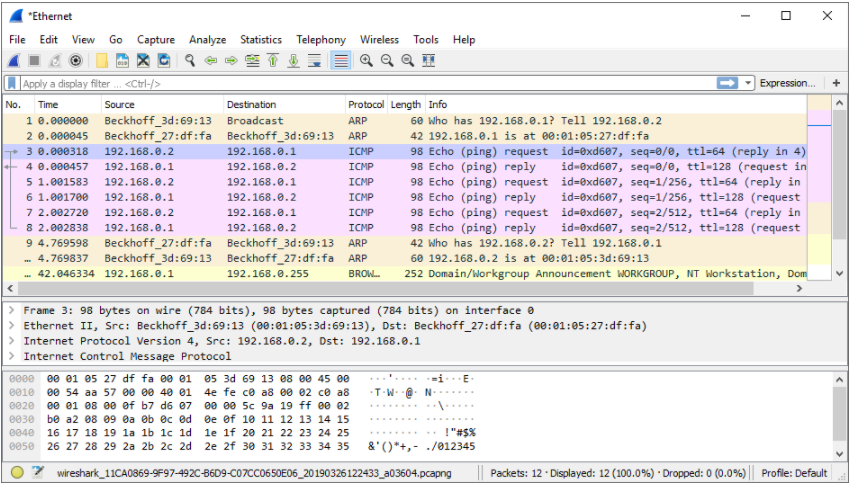
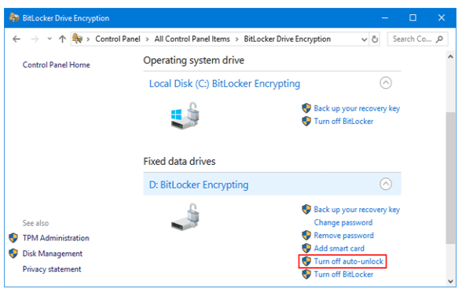
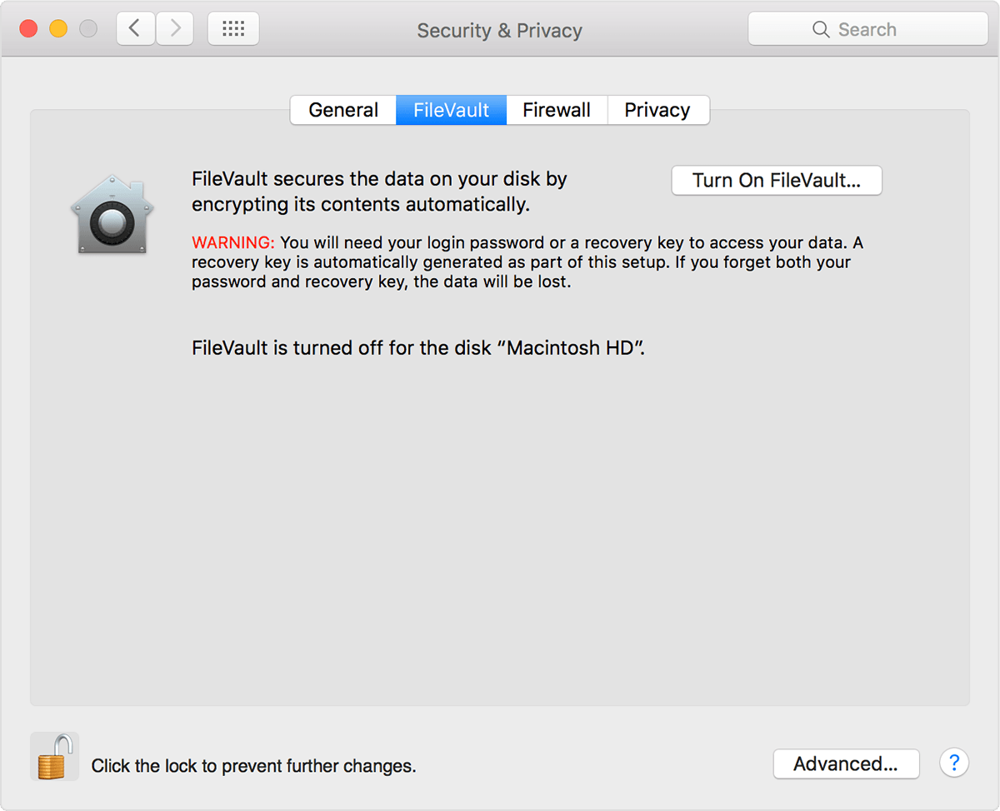
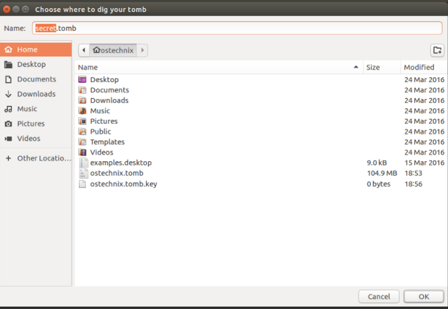
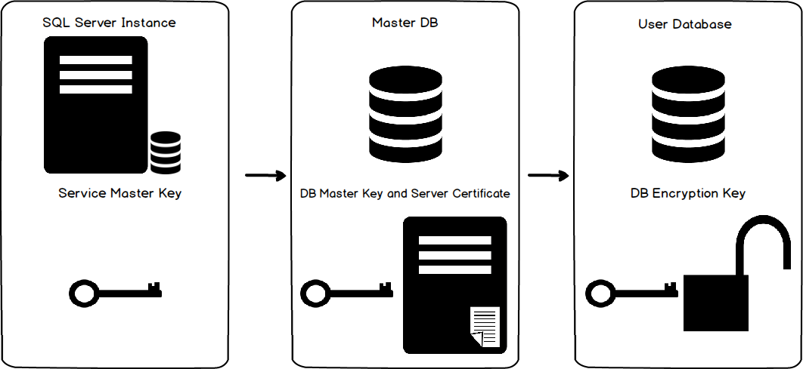

## 28 - Securing Data in your Applications ##
_____________________________________________________________

<!-- 2021-01-17 21:20:20 -->

## RESTING OR MOVING ##

<p align="center">
    
</p>

**DATA IN TRANSIT**
These are data that is on the move. These could be data that we are shipping to a 3rd-party vendor over https or sftp.

Here we have to make sure that the transmission is as secure as possible. Ways to do this:
- Usernames and passwords
- keys-SSH
- identified by certificates
- transmission protocols such as HTTPS or SFTP
- using ssh to interact thru command-line

**DATA AT REST**
Data that is stored. This includes files on encrypted disks, encrypted database/s. This could also be scripts authenticating to network devices which uses usernames and passwords.
________________________________________________________

## SECURE DATA IN TRANSIT ##

This involves hasing usernames and passwords instead of them appearing in clear text. A tool which can sniff information and traffic across a network is **Wireshark**.

<p align="center">
    
</p>

______________________________________________________________

## ENVIRONMENT VARIABLES ##

These comes in evry operating systems. These are basically just variables, stored in the OS environment.

We can easily create en environemnt variable in a Linux OS by using the *export* command and then test the environemnt variable using the *echo* command

```bash
export VARIABLE='This will be stored in that variable'
echo $VARIABLE
This will be stored in that variable
```

We can now easily use this environment variable in our code. In python, we can utilize the OS module to make use of the environment variable.

```python
>>> import os
>>> value = os.environ.get('VARIABLE')
>>> print(value)
This will be stored in that variable
```

We can also use a .env.py file which will store environment variables. This can be useufl when transporting code or we can tell user to set their own environment variable using that .env file.

To start, install .env first in your machine:

```bash
sudo pip3 install python-env
```

Now create a .env file where you will store environment variables:
```bash
cat > .env
USER1='admin'
```

Using the earlier code, we can now use the .env module in our new sample.py:

```python
import os
from dotenv improt load_dotenv

new_user = os.environ.get('USER1')
print(new_user)
```

Running sample.py, we get the output:
```bash
$ python sample.py
admin
```
_____________________________________________________________

## SECURING DATA AT REST ##

Disk encryption is usually built on the operating system. This works by taking a key encrypting by encrypting every single bit of file that is on the disk and only the person who has the key can decrypt it.

In Windows, we can use **Bitlocker**.

<p align="center">
    
</p>

In MacOS, you can use **FileVault**.

<p align="center">
    
</p>

Since Linux is open source, anyone can implement their own encrypting solution. One of the popular option is called **Tomb**

<p align="center">
    
</p>


For databases such as **SQL Server**, database encryption works by generating a master key which decrypts the salev key and a slave key which is used to encrypt the database.


<p align="center">
    
</p>