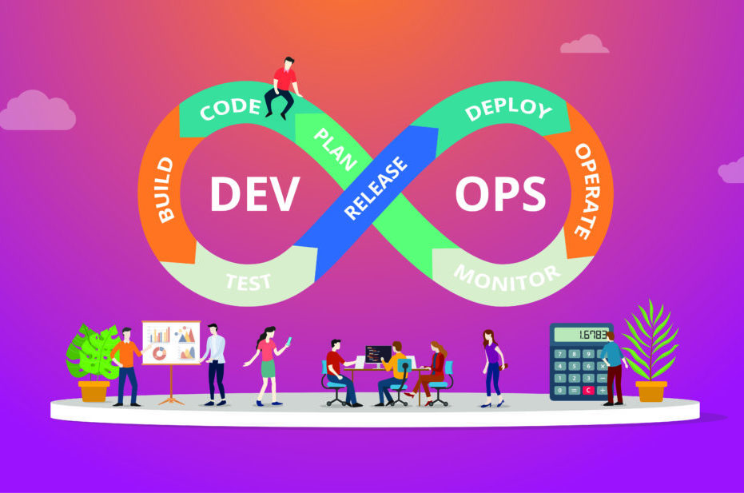

# 30 - Principles of DevOps Practices #
_________________________________________________________

<!-- 2021-01-17 23:49:35 -->

## WHAT IS DEVOPS? ##

A set of practices on how to deliver IT services. This include deploying software, infrastructure, networking etc.

    

Main concepts:
- Iterative and incremental
- Continuous and automated
- End-tto-end responsibility
_________________________________________________________

## ITERATIVE AND INCREMENTAL ##

In the traditional method:
- we wait for a certain period before deploying software
- as a result, lagre set of changes pile up
- this makes rollout complicated
- there's long delay between development and deployment
- slow time-to-market
- zero work-life balance

On the other hand, DevOps is about being iterative and incremental.

&nbsp;&nbsp;*High performance teams consistently deliver services faster and more reliably than their low-performing competition.*

Here, we utilize the **Agile Project Management** - a quick and iterative process of building, testing, and releasing changes in an incremental pattern.

Commits should also be frequent and routine. The more frrequently code are commited to your source control management, the mroe frequent the integration testing as well.

Main benefits of incremental and iterative changes:
- Easier integration
- Faster time to deployment
- Human-centric
________________________________________________________

## CONTINUOUS AND AUTOMATED ##

We are naturally risk-averse when ti comes to change. DevOPs solve this problem through nitroducing changes continuously.

By making changes **continuous**, we almo make our deployment routinary. We are forced to the idea of constantly updating changes in the code thus we ar eforced to address small problems in the software early on.

Another thing that makes deployments less-risky is the **automation** of deployment. HUmans are error-prone, thus having a robot do the job for us removes that tendency.

This also makes us **reliable**.
________________________________________________________

## END-TO-END RESPONSIBILITY ##

This is the main definition of DevOps. The word itself is a conjunction of two important roles that are traditionally siloed - **Development** and **Operations**.

**Organizational and Functional Visibility**
- Good access to feedback and instrumentation
- Cross-function training and Skills Development
- User-centric Planning and Development

