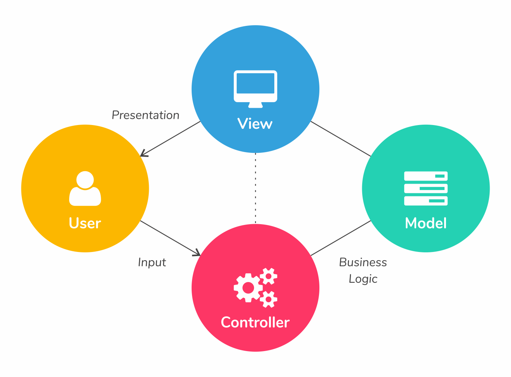

# 5-MVC - Model Vew Controller #
____________________________________________________
<!-- 2021-01-04 06:09:17 -->

## MODEL-VIEW CONTROLLER ##

    

A high-level abstraction where  responsibilities are divided up intro 3 loosely coupled components.

**MODEL**       
Stores or structures the data. Could be a class that represents the devices.

**VIEW**
Displays the data on the user screen

**CONTROLLER**  
Handles logic flow, user interactions, and directs models and views

