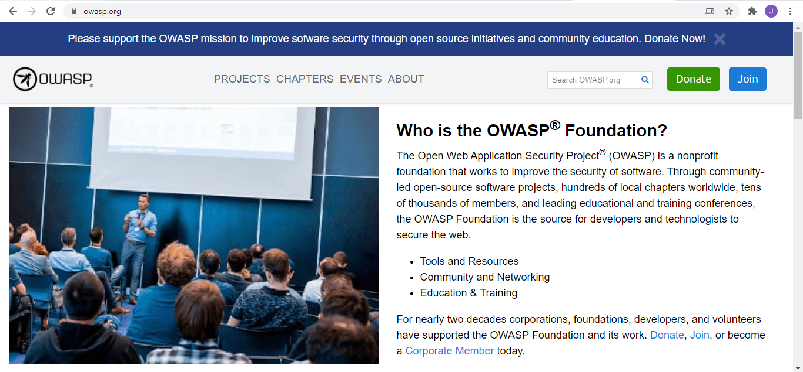
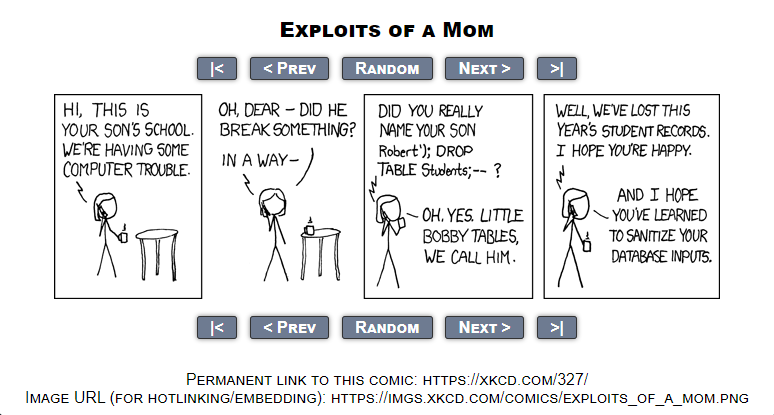
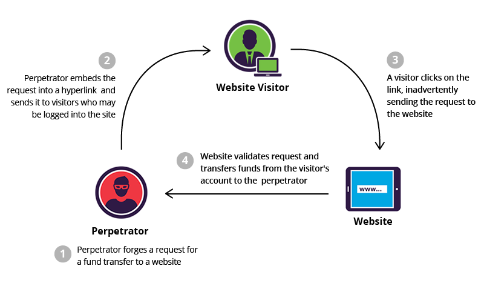

# 29 - OWASP Standard Threats #
_________________________________________________________

<!-- 2021-01-17 23:12:27 -->

## OWASP - Open Web Applications Security Project ##

This is a non-profit organization dedicated to education of developing applications with security in mind.

They are dedicated to telling you the kind of attacks that are out there and actions that you can take to mitigate the risks.

You can check out their site [here](https://owasp.org/).

    

_________________________________________________________

## XSS - CROSS-SITE SCRIPTING ATTACK ##

This is an **injection-style attack** - this is where we have a form that allows end-users to put their own data and attackers leverage this forms by typing in code onto the fields. This code bye javascrip, sql, etc.

    

This code is then carried out into the server and it will be injecting malicious code into the backend server.

This is mostly executed on sites with comment section. Someone who will browse the site will be downloading the contents of that site into their browser, adn this includes the malicious code injected in the comment section.

Fortunately, OWASP has their OWASP Cheetsheet for evasion of this kind of attack. You can view all the details [here](https://cheatsheetseries.owasp.org/cheatsheets/Cross_Site_Scripting_Prevention_Cheat_Sheet.html)

______________________________________________________

## SQL INJECTION ATTACK ##

Similar with XSS Attack, this is also an **injection-style attack**. A SQL code is used here, injected to the field of a website, submitted onto the backend database server and then perform SQL actions.

You can check out an interesting site with comics about security, [xkcd.com](https://xkcd.com/327/).

    

Similarly, OWASP has a prevetion sheet for this kind of attack. You can read all the detaisl [here](https://cheatsheetseries.owasp.org/cheatsheets/SQL_Injection_Prevention_Cheat_Sheet.html) 
_________________________________________________________

## XSRF - CROSS-SITE REQUEST FORGERY ATTACK ##

Recalling the previous two attacks mentioned:

- **Cross-site (XSS) Attack** - steal the token and impersonate someone or redirect users to a malicious website
 

- **SQL Injection Attack** - run SELECT statements and steal data or use SQL to perform malicious actions on the database.

With **Cross-site Request Forgery (XSRF) Attack**, the attacker is **forging** a request as if they're someone else.

    

The main difference is the attacker will perform actions on a website as if it's the original user. An instance could be that the user buys something from the site and since the attacker can perform actions in your behalf, he can have the item shipped to his address instead.

You can read how to prevent these attacks through OWASP Cheat sheets [here](https://cheatsheetseries.owasp.org/cheatsheets/Cross-Site_Request_Forgery_Prevention_Cheat_Sheet.html)