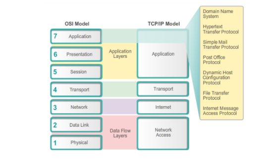
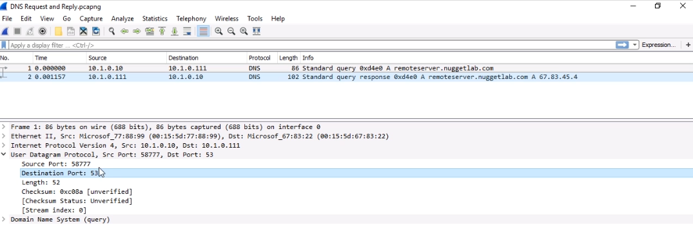
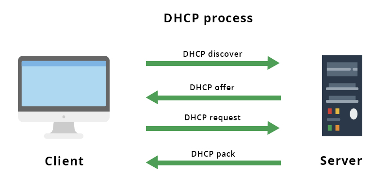

<!-- 2021-01-18 09:03:52 -->

# 31 - The Application Layer # 
_________________________________________________________

## THE TCP/IP and APPLICATION LAYER ##

    

Think of the application later as **services**.
Examples of application layer services include:
- HTTP/HTTPS
- telnet/ssh
- DNS
- NTP - network time protocol
_________________________________________________________

## PORTS OVERVIEW ##

There are well-known, published ports for specific network sevices that are agreed to.

Well-known ports include:
- **HTTP**  - TCP:80
- **HTTPS** - TCP:443
- **Telnet** - TCP:23
- **SSH** - TCP:22
- **NETCONF** - TCP:830
- **DHCP (Server port)** - UDP:67
- **DHCP (Client port)** - UDP:68
- **DNS** - UDP:53
- **NTP** - UDP:123

One way we can visualize how ports work and the exchange of DNS traffic is through packet captures. For this, we can use **Wireshark**.

    

_________________________________________________________

## COMMON IP SERVICES ##

Here we'll be discussing about the common functionality of DHCP, DNS, SNMP, and NTP.

**DHCP**
Dynamic Host Control Protocol. Dynamic assignment of IP addresses, which means we don't have to manually configure these network ip addresses on the clients.
This utilizes the D.O.R.A process

    D - Discover
    0 - Offer
    R - Request
    A - Acknowledge

    

To see more details about D.O.R.A, you can check out this [link](https://ipwithease.com/understanding-dora-process-in-dhcp/).

 

**DNS**
Domain Name Resolution - all about resolving name to ip addresses. There is also a **Reverse lookup** which takes an ip address and resolve it to a name using the dns server.
 

**NTP**
Network Time Protocol - This is where we have a server connected to an authoritative time server that is synchronizing its time using NTP, and the other servers in the entwork synchronizing their time through the server connected to the authoritative time server.
 

**SNMP**
Simple Network Management Protocol - hacing SNMP agents running on network devices and query those agents using SNMP.
_________________________________________________________

