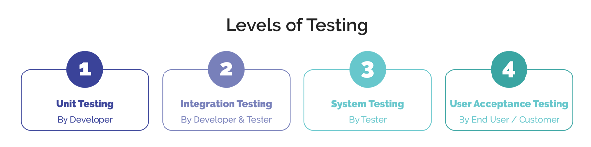
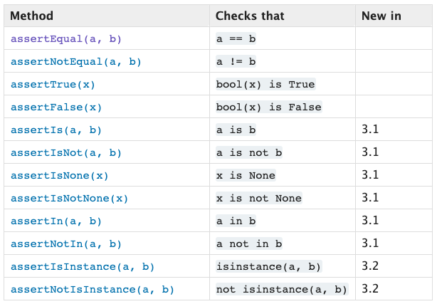
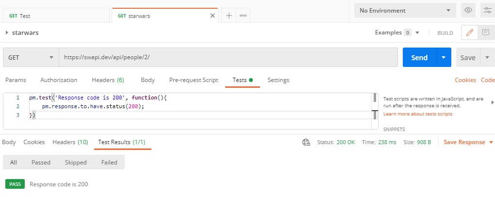

<!-- 2021-01-18 21:42:42 -->
# 33 - Unit Tests and TDD #
_________________________________________________________

## UNIT TESTING ##

This allows us to verify that the individual parts of our code are working as expected. This also allows us to practice **TDD** or **Test-Driven Development**.

<p align=center>
    
</p>

**Unit Testing** is the testing done early in the process.
There is a couple of tests to be done, first of which is the Unit Testing:

1.  Unit Testing
2.  Integration Testing
3.  System testing
4.  Acceptance testing (UAT)

Main concept of Unit Testing:

- granular
- modular
- whenever possible - **automated!**

Some terminologies we need to understand
- **Unit** - the piece of code/automation being tested.
- **Test case** - the code eprforming the test.
- **Test Runner** - the script/execution engine for automating use cases, and then summarize the results for you.

Let's use the circletest.py below:

```python
import math
import unittest

# this is the function that we'll test
# This computes circumference fo a circle, given the radius (r)
def circum(r):
    return 2*math.pi*r

# this is the test case
class testcircle(unittest.TestCase):
    def testcircum(self):
        # if cirucm(5) is equal to value after it,
        # it will return OK
        self.assertEqual(circum(5),31.41592653589793)

# calls the testcase
unittest.main()
```

When this code is run, it should return the following:

```bash
$ python circletest.py 
----------------------------------------------------------
Ran 1 test in 0.001s

OK
```

________________________________________________________

## USING THE PYTHON UNITTEST MODULE ##

**unittest** is a built-in testing framework that ships with Python. The steps to follow are:

1.  Create a testcase by subclassing **unittest.testCase**.
2.  Define tests to be done by creatign methods beginning with **tests**.
3.  Inside of those test methods, we can use *assertion methods*. Below are just some of the examples:

<p align=center>
    
</p>

You can check out more details about the unittest module [here](https://docs.python.org/3/library/unittest.html).
_________________________________________________________

## UNIT TESTING WITH POSTMAN ##

Postman uses the **CHAI Assertion Library** to enable unit testing in it's post-response scripts.

**CHAI** is a **Behavior-Driven Development (BDD)** design that relies on language chains. An exampl of this is:

    expect([1,2]).to.be.an('array').that.does.not.include(3);

You could read more about CHAI [here.](https://www.chaijs.com/api/bdd/)

Going to postman, you can run a post-response test by clicking the *Test* tab. You can use the link below as URL to test. 

    https://www.postman-echo.com/get

You can use the commands below for the post-response test.
Hit *Send* afterwards.

    pm.test('Response code is 200', function(){
        pm.response.to.have.status(200);
    })

What this test does, is it simple checks if the status code returned is 200. If yes, then it will show a green **Pass** at the bottom.


________________________________________________

## TEST-DRIVEN DEVELOPMENT (TDD) ##

It is different with the way we traditonally do software testing. With TDD, we write the tests **firsts** before writing the actual code, and then run the test.

These tests will fail the first time it runs because there's still no code created.

This force us to implement sound practices:
- small, iterative changes
- automated test suite/runner
- tests become design exploration tools
