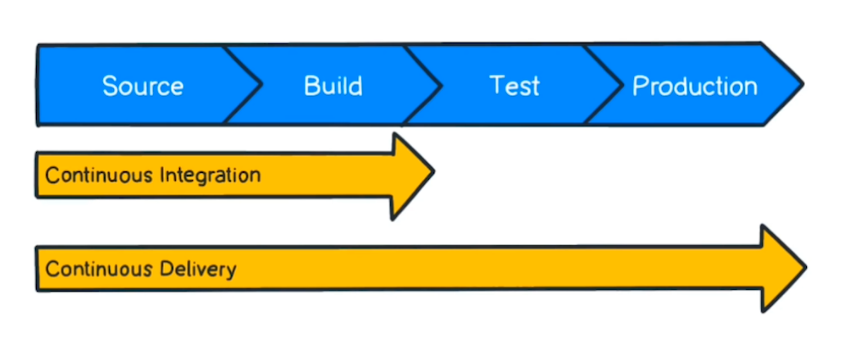
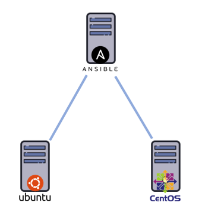
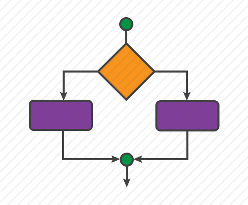

<!-- 2021-01-18 23:01:11 -->

# 34 - Install and Configure Ansible #
________________________________________________________

*EDEN: Please note that this is a comprehensive document as these are my notes for the entire section of 'Installing and Configuring Ansible' in the CBT Nuggets-DevAsc course which is taught by Knox Hutchinson.*

## ANSIBLE ##

Network automation tool of choice by majority because it comes with built-in orchestration capabilities for any platform.
<br>

<p align=center>
    
</p>

<br>
In this notes, we'll go over:

- Introduction to Infrastructure as Code 
- How Ansible is being utilized to automate and orchestrate servers and network devices.
- Installing Ansible
- Configuring remote devices
- Inventory File, Modules, and Playbooks
- Variables and Facts
- Conditionals and Loops
________________________________________________________

## INFRASTRUCTURE AS CODE ##

Rather than configuring individual devices thru the command line or GUI, networks can now be deployed from code or scripts.

The main ides behind Infrastructure as Code in CICD is the idea behind DevOps - integrating our development efforts and our oepratiosn effort in one cohesive environment.

<p align=center>
    
</p>

With infrastructure as code, we have a single base-level of production. Basically, this is like deploying infrastructure from documentation.

We now can be sure that servers can be spun up quickly and reliably and the process can be repeated many times over because they all came from the same code and we have made sure that this code works.

When some things are changed, they must be checked in, approved, and tested in the code. THese changes will then cascade to the other environemnts built from the same piece of code.

Ansible checks in and verifies that the code is being maintained to its desired state.
________________________________________________________

## CICD PIPELINE ##


<p align=center>
    
</p>

<sub>*EDEN: This has been already discussed in depth in Ben FInkel'ss CICD section. Please see '27-CICD_Pipeline'.md under Notes_20-29 folder.*</sub>

________________________________________________________

## INSTALLING ANSIBLE ON UBUNTU 18.04 ##

For this one, I just followed the installation steps that are in Knox's repo, which you can check out [here.](https://github.com/DataKnox/CodeSamples/blob/master/Ansible/Intro/setup.sh)

**SETUP**
We have 3 Linux machines machines:

<p align=center>
    
</p>

- **Master** - Ubuntu 18.04 that will run the Ansible. 

- **Host-Ubuntu** - Ubuntu 18.04

- **Host-CentOS** - CentOS

All these three linux machines have the same username and password configured, and with sudo priveleges.

Once Ansible is installed in **Master**, we'll configure the two **Host** machines to allow ***SSH access with keys***, instead of passwords.

That way, **Master** will just present a certificate to each **Host** machine instead of providing a password everytime.

**RECAP**
1.  Install Ansible on **Master**
2.  Configure **Host-Ubuntu** and **HOst-CentOS** to allow SSH with keys.
_________________________________________________________

## ACTUAL INSTALLATION ##

*EDEN: Please note that I used AWS EC2 instances in doing this lab. To have the same username in all three linux machines, I used the scripts [here](changing_default_system_username_ec2.txt)*

*I also created a vpc, a single subnet,route table, and an internet gateway in AWS for this lab.*

<p align=centere>
    
</p>

Begin by installing all the pre-requisite packages and libraries. Also make sure to update the base OS

```bash
sudo apt update
sudo apt install -y software-properties-common
sudo apt-add-repository ppa:ansible/ansible

# update base OS again.
sudo apt-get update
```

Note that you may need to install python as well. After all is done, you can now install ansible

```bash
sudo apt-get install ansible -y
```

Run the ping module against teh localhost to make sure the ansible is setup correctly.

```bash
ansible localhost -m ping
```

You should get an output like this:

```bash
$ ansible localhost -m ping
localhost | SUCCESS => {
    "changed": false, 
    "ping": "pong"
}
```
________________________________________________________________________

## CONFIGURING REMOTE HOSTS ##

On the **master**, configure local hosts file to include local hostnames of the **hosts** machines.
By doing this, the **|master** should now be able to resolve the ip addresses of the **hosts** machines to their name and vice versa.

```bash
sudo nano /etc/hosts

    127.0.0.1 localhost
    127.0.0.1 master
    10.0.0.61 host-ubuntu
    10.0.0.168 host-centos
```

You could test this by pinging both **hosts** from **master**.

```bash
$ ping -c 3 host-ubuntu 
$ ping -c 3 host-centos
```

Next step is to make sure the **hosts** devices trusts **master** when it presents the ssh keys to them. We first start with generating ssh keys. Leave the defaults for the succeeding questions.

```bash
$ ssh-keygen
```
The command above returns the location of the saved ssh keys:

    Your identification has been saved in /home/ubuntu/.ssh/id_rsa.
    Your public key has been saved in /home/ubuntu/.ssh/id_rsa.pub

The id_rsa.pub is the public key that you'll be working with. You can check out the keys:

```bash
$ ls .ssh
authorized_keys  id_rsa  id_rsa.pub
```
Before copying the ssh keys onto the **hosts** machine, make sure that ssh is enabled on those machines. Checking on the both **hosts**:

```bash
$ sudo apt install -y openssh-server
$ sudo yum install -y openssh-server
```
Back on the **master**, try copying the ssh keys onto the **host-ubuntu**

    ssh-copy-id .ssh/id_rsa.pub host-ubuntu

If you get the error below, you can try these [steps](error_ssh-copy-id.txt).

```bash
/usr/bin/ssh-copy-id: INFO: Source of key(s) 
to be installed: ".ssh/id_rsa.pub"
/usr/bin/ssh-copy-id: INFO: attempting to log in with the new key(s), to filter out any that are already installed
/usr/bin/ssh-copy-id: INFO: 1 key(s) remain to be installed -- if you are prompted now it 
is to install the new keys
```
If all goes well, you should be seeing confirmation that the ssh key was copied to the **hosts**

    $ ssh-copy-id -i .ssh/id_rsa.pub host-ubuntu
    Number of key(s) added: 1

    $ ssh-copy-id -i .ssh/id_rsa.pub host-centos
    Number of key(s) added: 1

You should also be able to ssh to **host-ubuntu** and **host-centos** from **master** without entering a password.

Now we have to make sure ansible can execute some commands with root privileges without being prompted for a password.

On each **hosts**, edit the /etc/sudoers files and add your username:

    sudo visudo

    #very bottom of file add this line:
    eden ALL=(ALL) NOPASSWD: ALL

At this point, **master** now has full end-to-end sudo privilege on all **hosts** machines.

________________________________________________________

## INVENTORY ##

Ansible uses an **Inventory file** - contains data about all the servers and devices that it needs to manage.

<p align=centere>
    
</p>

To create/modify the inventory file:

    sudo nano /etc/ansible/hosts

Create a *group*, which will be denoted by [group] format. You then specify the servers under that. You can create multiple groups with servers underneath.

You can then also nest groups. Check *[linuxhosts]* below which nests the first 2 groups.

It should look like this:

    [serversubuntu]
    host-ubuntu

    [serverscentos]
    host-centos

    # Nested group
    [serverslinux:children]
    serversubuntu
    serverscentos

You can also specify a username, like this:

    host-ubuntu ansible_user=administrator

To test this, run the ping module againsts all hosts in the inventory file.

    ansible -m ping all

You should get an output like this:

```bash
host-centos | SUCCESS => {
    "ansible_facts": {
        "discovered_interpreter_python": "/usr/bin/python"    }, 
    "changed": false, 
    "ping": "pong"
}
host-ubuntu | SUCCESS => {
    "ansible_facts": {
        "discovered_interpreter_python": "/usr/bin/python"    }, 
    "changed": false, 
    "ping": "pong"
```

You can also ping the individual groups:

    ansible -m ping serversubuntu
    ansible -m ping serverscentos
    ansible -m ping serverslinux

If you got an error, here's a [link](https://stackoverflow.com/questions/44267060/ansible-warning-found-both-group-and-host-with-same-name/49050989) which you can check out.

_________________________________________________________

## MODULES ##

Ansible, in its very core, is just *pre-built python scripts.*. These pre-built python scripts are called **modules**. We've already test this when we used the *ping* module earlier.

<p align=center>
    
</p>

We can test another script by checking the uptime of all our hosts using a raw module.

    ansible -m raw -a '/usr/bin/uptime' linuxhosts

You should get a similar output:

```bash
host-ubuntu | CHANGED | rc=0 >>
 17:10:28 up  1:28,  2 users,  load average: 0.02, 0.01, 0.00
Shared connection to host-ubuntu closed.

host-centos | CHANGED | rc=0 >>
 17:10:28 up  1:28,  2 users,  load average: 0.04, 0.01, 0.00
Shared connection to host-centos closed.
```

We could also check the python version running on the hosts.

    ansible -m shell -a 'python3 -V' linuxhosts

You should get a similar output:

```bash
host-centos | CHANGED | rc=0 >>
Python 3.7.9
host-ubuntu | CHANGED | rc=0 >>
Python 3.6.9
```

We can check the user account on the hosts. 
    
    ansible all -a 'whoami'

Output:

```bash
host-centos | CHANGED | rc=0 >>
eden
host-ubuntu | CHANGED | rc=0 >>
eden
```

We can elevate to root with -b ("become"). Note that ansible doesnt elevate the user account to sudo by default so we'll use this later when we need to elevate privileges.

    ansible all -b -a 'whoami'

Output:

```bash
host-centos | CHANGED | rc=0 >>
root
host-ubuntu | CHANGED | rc=0 >>
root
```

Recall that earlier we had to modify the /etc/sudoers file by including out user account. If we hadn't did that and we run the command above to elevate to root privileges, we'll be prompted to enter a password for each host.
________________________________________________________________

## THE ANSIBLE PLAYBOOK ##

<p align=center>
    
</p>

Ansible works by running *'plays'* against the devices you specify, which in turn run the modules you also specified on thos devices. These plays are all described in the **playbook**.

A **Playbook** is a YAML file which outlines all the instructions to run the plays.

<p align=center>
    

*EDEN: YAML basics id discussed in Ben Finkel's section for Plain-text Data Formats. You can check out the notes [here](../Notes_0-9/7-XML_JSON_YAML.md)*

For our first *play* - [stats.yml], we'll give it this name. What this will do is it will connect to all the **hosts** and get some stats information and write it to a text file in the desktop.

```yaml
---
- name: Get stats then write to textfile
```

We then specify the **hosts** where we'll run the action against. Here we'll specify the group *serverslinux*.

```yaml
---
- name: Get stats then write to textfile
  hosts: serverslinux
```

Next, we'll specify the tasks that it'll be running. We can set multiple groups for each task.

For the first task, we then state the actual module name **shell**, followed by the parameters or command/s to run.

What this does is it runs the **uname** command on each host, which will get the system information and direct the output to **task-output.txt**.

Note that the **task-output.txt** will be created on the **hosts** machine, not on the **master**.

```yaml
---
- name: Get stats then write to textfile
  hosts: serverslinux
  tasks:
    - name: get system status and info
      shell: uname -a > /home/eden/ansible/task-output.txt
```

To add another task, we simply specify another name for the task, then the module which will be followed by the command.

For the second command, we'll just get the user account currently logged in and append it to the same **task-output.txt**

```yaml
---
- name: Get stats then write to textfile
  hosts: serverslinux
  tasks:
    - name: get system status and info
      shell: uname -a > /home/eden/ansible/task-output.txt
    - name: print username
      shell: whoami >> /home/eden/ansible/task-output.txt
```
To execute this playbook, switch to the directory where the playbook is, and then run **ansible-playbook** followed by the YAML file.

    ansible-playbook stats.yml

You should get an output like this:

```bash
PLAY [Get stats then write to textfile] ****************************************

TASK [Gathering Facts] *********************************************************
ok: [host-ubuntu]
[WARNING]: Platform linux on host host-centos is using the discovered Python
interpreter at /usr/bin/python, but future installation of another 
Python
interpreter could change this. See https://docs.ansible.com/ansible/2.9/referen
ce_appendices/interpreter_discovery.html for more information.
ok: [host-centos]

TASK [get system status and info] **********************************************
changed: [host-ubuntu]
changed: [host-centos]

TASK [print username] **********************************************************
changed: [host-ubuntu]
changed: [host-centos]

PLAY RECAP *********************************************************************
host-centos                : ok=3    changed=2    unreachable=0    failed=0    skipped=0    rescued=0    ignored=0
host-ubuntu                : ok=3    changed=2    unreachable=0    failed=0    skipped=0    rescued=0    ignored=0
```

From the output, we first see on the first line the play that we're running

    PLAY [Get stats then write to textfile]

Next, we see that there were actually *three* tasks executed.
- Task 1 - Gather Facts - this is always the first task being done.
- Task 2 - get system status and info
- Task 3 - print username

At the bottom of the output, we see a summary of the play. 

The **ok** field specified how many tasks were performed successfully (in this case all three are executed well). 

The **changed** field tells us on the number of hosts we did a change (in this case we introduce a change on both **hosts** files when we created the **task-output.txt**)

```bash
PLAY RECAP *********************************************************************
host-centos                : ok=3    changed=2    unreachable=0    failed=0    skipped=0    rescued=0    ignored=0
host-ubuntu                : ok=3    changed=2    unreachable=0    failed=0    skipped=0    rescued=0    ignored=0
```
________________________________________________________________

## VARIABLES AND FACTS ##

Here we'll be utilizing **static variables** which we can use when we move between devices.

<p align=centere>
    
</p>

As an example, the [variable.yml](variable.yml) below shows a demo on how we'll write variables onto a text files on the device themselves. 

We specify the variables under the **vars** keyword. To use variables in the actual commans, we denote them by enclosing them in **{{}}**.

```yml
---
- name: Variable demo
  hosts: serverslinux
  vars:
    - var1: Peterpan
    - var2: merry-go-round
  tasks:
    - name: Print data
      shell: echo "{{var1}} went for a ride on the {{var2}}" > /home/eden/vars.txt
```

We run the playbook:

    ansible-playbook variable.yml

You should get an output like this:

```bash
PLAY [Variable demo] *************************************************************

TASK [Gathering Facts] ***********************************************************
ok: [host-ubuntu]
ok: [host-centos]

TASK [Print data] ****************************************************************changed: [host-ubuntu]
changed: [host-centos]

PLAY RECAP ***********************************************************************host-centos                : ok=2    changed=1    unreachable=0    failed=0    skipped=0    rescued=0    ignored=0
host-ubuntu                : ok=2    changed=1    unreachable=0    failed=0    skipped=0    rescued=0    ignored=0
```

On the first line we see the play that is running.
It is followed by the tasks. We can see that the **first task** is always **Gathering Facts** which is then followed by the tasks we specify in the play.

Last is a full recap of the play, the **ok** field which shows how many successfull tasks were performed, the **changed** field shows how many changes were introduced, and the other fields which return zero.

Going to each **host**, we should see a **vars.txt** which contains the following:

    Peterpan went for a ride on the merry-go-round

Here we see that it has successfully performed the two tasks. But what does the first task, **Gathering Facts** really do?
<br>

**GATHERING FACTS**

When ansible connects to the hosts or devices, it gathers system information on each one and base the execution of the tasks on those information.

<p align=center>
    
</p>

As an example, the main difference between Centos distros and Debian distros is the **package manager** being used. CentOS and RHEL uses **yum** to install packages while Ubuntu uses **apt**.

In **Gathering facts**, what's really happening uder the hood is, ansible runs the **setup module** on the specified hosts. We can see this by running the command below to see the facts gathered just on **host-ubuntu**.

    ansible host-ubuntu -m setup

You could further filter the facts you want to see by using

    ansible host-ubuntu -m setup -a "filter=*ansible_os_family"
    ansible host-ubuntu -m setup -a "filter=*ansible_user_id"  

<br>

In the [facts.yml](facts.yml) below, we didn't specify any static variables but instead use *dynamic variables* which will be different on every host that ansible will go to.

```yml
---
- name: Prints the facts and save them on a facts.txt
  hosts: host-ubuntu
  tasks:
    - name: Print OS family to file
      shell: echo "The Linux OS family is {{ansible_os_family}}." > /home/{{ansible_user_id}}/os-family.txt
    - name: Print default machine NIC name to console
      debug: msg="{{ansible_default_ipv4.interface}}"
    - name: Register ls results variable
      command: "ls"
      register: dirs
    - name: Print 'dirs' variable from last step to console
      debug:
        msg: "{{dirs}}"
```

Here we have specified four tasks, but again we have a total of 5 tasks if we include the **gathering facts**. For the sake of clarity, we'll refer to the *gathering facts* as **Task 1** and the first specified task as **Task 2**. 

In **Task 2**, we tell ansible to write the OS family of the host on text file. We also specified on which user directory file we want the **os-family.txt** to be created by based on the user that's running the file. This is done by the **ansible_user_id**.

```yml
    - name: Print OS family to file
      shell: echo "The Linux OS family is {{ansible_os_family}}." > /home/{{ansible_user_id}}/os-family.txt
```

In **Task 3**, we tell ansible to print the default NIC name that the **host** machine is using to send traffic out. 

Here you can see that all the ***ansible_xxxx*** variables are based on the **facts** gathered in **Task 1**.

```yml
    - name: Print default machine NIC name to console
      debug: msg="{{ansible_default_ipv4.interface}}"
```

Another way of using variables is to store command outputs to them.

In **Task 4**, we have a *command* which doesnt' return anything to the console. We then save the results of that command to a variable by *registering* them.

```yml
    - name: Register ls results variable
      command: "ls"
      register: dirs
```

In **Task 5**, we print out the registered variable onto the console by using the **debug** module.

```yml
    - name: Print 'dirs' variable from last step to console
      debug:
        msg: "{{dirs}}"
```

We test this by running the ansible-playbook:

    ansible-playbook facts.yml

You should get a similar output:

```bash
PLAY [Prints the facts and save them on a facts.txt] ***************************

TASK [Gathering Facts] *********************************************************
ok: [host-ubuntu]

TASK [Print OS family to file] *************************************************
changed: [host-ubuntu]

TASK [Print default machine NIC name to console] *******************************
ok: [host-ubuntu] => {
    "msg": "eth0"
}

TASK [Register ls results variable] ********************************************
changed: [host-ubuntu]

TASK [Print 'dirs' variable from last step to console] *************************
ok: [host-ubuntu] => {
    "msg": {
        "changed": true, 
        "cmd": [
            "ls"
        ], 
        "delta": "0:00:00.003013", 
        "end": "2021-01-21 02:14:04.813158", 
        "failed": false, 
        "rc": 0, 
        "start": "2021-01-21 02:14:04.810145", 
        "stderr": "", 
        "stderr_lines": [], 
        "stdout": "os-family.txt\ntask-output.txt\nvars.txt", 
        "stdout_lines": [
            "os-family.txt", 
            "task-output.txt", 
            "vars.txt"
        ]
    }
}

PLAY RECAP *********************************************************************
host-ubuntu                : ok=5    changed=2    unreachable=0    
failed=0    skipped=0    rescued=0    ignored=0

```

On the **host-ubuntu** machine, you should ahve a new **os-family.txt** file which contains:

    The Linux OS family is Debian.

________________________________________________________________

## CONDITIONALS ##

How **Conditionals** work in ansible is just similar on how conditionals work on any programming languages. The execution of code is based on the specified conditions

<p align=center>
    
</p>

Below we have the [condition.yml](condition.yml) file where we'll be installing packages. 

```yml
---
- name: Conditions Demo 1 - Installing NGINX
  become: true
  hosts: serverslinux
  tasks:

    - name: Install NGINX on host-ubuntu
      apt: name=nginx state=latest
      register: result
      ignore_errors: true

    - name: Install NGINX on host-centos
      # yum: name=epel-release
      yum: name=nginx
      when: result is failed
```

*EDEN: My code kept failing when I try to run Knox's code for the condition,yml. Not sure if it's comptability issue with the version sinc ehis seems to work in the lecture video while mine doesn't. After some searching on the internet, I changed the 'result|failed' to 'result is failed' which seem to do the trick.*

(You can check out this helpful [link](https://docs.ansible.com/ansible/latest/user_guide/playbooks_conditionals.html))

<br>
Recall that when installing packages in any linux distributions, you need to have *sudo privileges*. To elevate our user to sudo privileges, we set the **become** field to true.

```yml
  become: true
```

In **Task 2**, we tell ansible to install NGINX on **host-ubuntu**. Since it's an Ubuntu machine, we'll use the **apt** module. Here we specify the name of the package and version to be used (latest).

Note that ansible will run the **apt** module on both **hosts** and since the other host is a CentOS machine, it will cause a failure in CentOS. When ansible runs into errors, it will undo the most recent action it did, which in this case, it will roll-back the changes did to the CentOS machine.

We can tell ansible to ignore the failure by setting **ignore_errors** to yes. We then save the output of the failure to variable called **results**

```yml
    - name: Install NGINX on host-ubuntu
      apt: name=nginx state=latest
      ignore_errors: yes
      register: results
```

In **Task 3**, we then install NGINX on the other host, which is a CentOS machine. Note that this will only execute **if** the preceeding task failed. This is specified by setting the value of **when**.

```yml
    - name: Install NGINX on host-centos
      yum: name=nginx state=latest
      when: results is failed
```

*EDEN: Note that for NGINX to be installed on a CentOS machine, you must first have epel-release installed.*

(You can see basic installation of NGINX on CentOS [here](https://www.digitalocean.com/community/tutorials/how-to-install-nginx-on-centos-7))

<br>
We now test by running the ansible playbook

    ansible-playbook condition.yml

You should get an output like this:

```bash
PLAY [Demo of conditionals] ****************************************************

TASK [Gathering Facts] *********************************************************
ok: [host-centos]
ok: [host-ubuntu]

TASK [Install NGINX on host-ubuntu] ********************************************
[WARNING]: Updating cache and auto-installing missing dependency: python-apt
fatal: [host-centos]: FAILED! => {"changed": false, "cmd": "apt-get update", "msg": "[Errno 2] No such file or directory", "rc": 2}
...ignoring
changed: [host-ubuntu]

TASK [Install NGINX on host-centos] ********************************************
skipping: [host-ubuntu]
changed: [host-centos]

PLAY RECAP *********************************************************************
host-centos                : ok=3    changed=1    unreachable=0    failed=0    skipped=0    rescued=0    ignored=1
host-ubuntu                : ok=2    changed=1    unreachable=0    failed=0    skipped=1    rescued=0    ignored=0
```

In **Task 2**, we can see that it failed when trying to install nginx to **host-centos**. This is then ignored and proceeded with installing NGINX in **host-ubuntu**

```bash
TASK [Install NGINX on host-ubuntu] ********************************************
[WARNING]: Updating cache and auto-installing missing dependency: python-apt
fatal: [host-centos]: FAILED! => {"changed": false, "cmd": "apt-get update", "msg": "[Errno 2] No such file or directory", "rc": 2}
...ignoring
changed: [host-ubuntu]
```

In **Task 3**, we see that **host-ubuntu** is skipped since NGINX is already installed on it and it proceeded to install NGINX to host-centos

```bash
TASK [Install NGINX on host-centos] ********************************************
skipping: [host-ubuntu]
changed: [host-centos]
```

At the very last is a summary of the play. This summary is helpful when troubleshooting errors if ever some tasks fail.

```bash
PLAY RECAP *********************************************************************
host-centos                : ok=3    changed=1    unreachable=0    failed=0    skipped=0    rescued=0    ignored=1
host-ubuntu                : ok=2    changed=1    unreachable=0    failed=0    skipped=1    rescued=0    ignored=0
```

Checking both **hosts** machine, you should be able to see nginx installed

```bash
eden@host-ubuntu:~$ which nginx
/usr/sbin/nginx

eden@host-centos:~$ which nginx
/usr/sbin/nginx
```

There are some other useful links which you can also check out:
- [Intro to playbooks](https://docs.ansible.com/ansible/latest/user_guide/playbooks_intro.html)
- [Run Your First Command and Playbook](https://docs.ansible.com/ansible/latest/network/getting_started/first_playbook.html)
- [How to use 'when' conditions in ansible playbook](https://www.linuxtechi.com/use-when-conditions-in-ansible-playbook/)
- [Condtionals](https://docs.ansible.com/ansible/latest/user_guide/playbooks_conditionals.html)
- [Playbook conditionals](https://docs.ansible.com/ansible/2.3/playbooks_conditionals.html)

<br>

On our next example, [conditions2.yml](conditions2.yml), we will be doing the reverse by uninstalling NGINX on both our **hosts** machines. Here we'll use **when** in a different way

```bash
---
- name: Conditions Demo 2 - Uninstalling NGINX
  become: true
  hosts: serverslinux
  tasks:

    - name: Uninstall NGINX on host-ubuntu
      apt: name=nginx state=absent
      when: ansible_os_family == "Debian"
    
    - name: Uninstall NGINX on host-centos
      yum: name=nginx state=absent
      when: ansible_os_family == "RedHat"
```

Instead on failing a task on one of the **host**, we tell ansible to run the **apt** module only when the OS of the **host** is Debian and run the **yum** module only when the OS is RedHat.

We can test this by running the playbook.

    ansible-playbook condition2.yml

You should get a similar output like this:

```bash
PLAY [Conditions Demo 2 - Uninstalling NGINX] ************************************************

TASK [Gathering Facts] ***********************************************************************
ok: [host-centos]
ok: [host-ubuntu]

TASK [Uninstall NGINX on host-ubuntu] ********************************************************
skipping: [host-centos]
changed: [host-ubuntu]

TASK [Uninstall NGINX on host-centos] ********************************************************
skipping: [host-ubuntu]
changed: [host-centos]

PLAY RECAP ***********************************************************************************
host-centos      : ok=2    changed=1    unreachable=0    failed=0    skipped=1    rescued=0    ignored=0
host-ubuntu      : ok=2    changed=1    unreachable=0    failed=0    skipped=1    rescued=0    ignored=0 
```

Going back to your **hosts** machines, you can see that NGINX is now removed.

```bash
eden@host-ubuntu:~$ which nginx

eden@host-centos:~$which nginx   
/usr/bin/which: no nginx in (/usr/local/bin:/usr/bin:/usr/local/sbin:/usr/sbin:/home/eden/.local/bin:/home/eden/bin)
```

*EDEN: You might still see NGINX installed in your Ubuntu machine eventhough the summary play showed it changed the host-ubuntu. After some searching, you may need to do some purging on the Ubuntu machine to fully remove NGINX from the system*

(For purging NGINX in Ubuntu, you can check out this [link](https://askubuntu.com/questions/235347/what-is-the-best-way-to-uninstall-nginx))

_________________________________________________________________

## LOOPS ##

Ansible can handle loops with different variables passed onto it, the same way that any programming language do.

<p align=center>
    
</p>

In the sample [loops.yml](loops.yml) below, we can see that second task - Install packages make use of loops through the use of **with items**.

What the second tasks does, is, it writes the '***item name***' onto a a ***loops.txt***. It gets the item name from the loops specified below it.

```yml
---
- name: Loops Demo
  hosts: host-ubuntu
  tasks:

    - name: Create a file
      shell: echo "Begin file" > /home/{{ansible_user_id}}/loops.txt
    
    - name: Install packages
      shell: echo "{{item}}" >> /home/{{ansible_user_id}}/loops.txt

      # this is basically same as 'for x in items'
      with_items:
        - vim
        - nano
        - python
```

Run the playbook to test it.

    ansible-playbook loops.yml

You should get an output like this:

```bash

PLAY [Loops Demo] *****************************************************************************

TASK [Gathering Facts] ************************************************************************
ok: [host-ubuntu]

TASK [Create a file] **************************************************************************
changed: [host-ubuntu]

TASK [Install packages] ***********************************************************************
changed: [host-ubuntu] => (item=vim)
changed: [host-ubuntu] => (item=nano)
changed: [host-ubuntu] => (item=python)

PLAY RECAP ************************************************************************************
host-ubuntu                : ok=3    changed=2    unreachable=0    failed=0    skipped=0    rescued=0    ignored=0
```

Checking on you **host-ubuntu** machine, you should see a **loops.txt** which contains:

    Begin file
    vim
    nano
    python
_______________________________________________________________

*EDEN: If you reach this part, CONGRATS!*

*Personally, it took me around 3-4 days before i reach the final video in the section. Since I didn't use a local VM and instead used AWS EC2 instances, there were a lot more work to be done in setting up the vpc, instances, route tables, and internet gateway*

*Things were not also as smooth as they are in the lecture video. Had to do lot of research on the internet which lead to me learning more.*

*This was quite a difficult section, but certainly an enjoyable one. I definitely enjoyed it, and I hope you did too.*

*The next section is all about automating your entire network with Ansible. It's probably a lot more challenging but I have high hopes, probably because I got so acquainted in Knox Hutchinson's approach in this subject.*

*Alright, I hope you've subscribed to CBT Nuggets as well and you're following the video alongside these notes.*

*See you on the next markdown file.*
________________________________________________