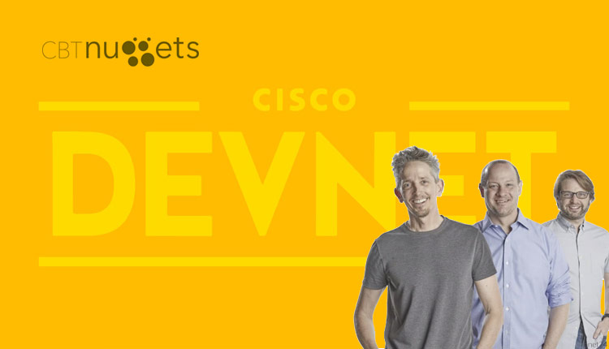

# Notes for CBT Nuggets - DevNet Associate Course #

This contains all my notes for the CBT Nuggets course by Keith Barker, Knox hutchinson, and Ben Finkel.

    

You may see that the notes are incomplete. I didn't take the course in a conventional manner and I just filtered the ones which I might need to learn at the moment and reserved the rest (which is mostly Cisco-focused stuff) for later.

I'm still in the process of studying this course so I'll be updating this from time to time.

**My experience so far:** each section is very informative with hands-on and some with labs which will help you gain the necessary skills to become DevNet certified.

The topics are a little light though, more of a breeze through on some devops concepts such as Docker, CICD, and the sorts. I guess since the concept of 'automation' and 'netdevops' are still on its early stage, the Cisco DevNet Associate Certification Exam is more of a way to encourage not just network engineers, but also system engineers to embrace the concepts of automation.

My goal here is to learn some of the concepts that tie in closely with the cloud, which is something I'm geared more towards.

The sections which I focused on are:

1.  Introduction
2.  Preparing VS Code for Development Environment
3.  Basic Programming and Control Flow
4.  Determine when to use Design Patterns
5.  XML, JSON, and YAML Data Formats
6.  Parse Data Formats into Python Structure
7.  REST API Fundamentals
8.  REST API Requests and Responses
9.  Parameters and Payloads for REST APIs
10. Authentication with HTTP and REST
11. Use Postman for API Interaction
12. Network Programmability and Automation Foundations
13. Prepare a Devnet Study Environment
14. Computing and Appilcation Deployment Models
15. Understand the Basics of Docker
16. Describe the Components of CICD Pipeline
17. Secure Data in your Applications
18. Identify OWASP Standard Threats
19. Understand the Basics of Linux and Bash
20. Identify the Principles of DevOps Practices
21. Use Git for Version Control
22. Collaboration with Git
23. Unit Tests and test-Driven Development
24. Install and Configure Ansible
25. Automate your Entire Network with Ansible

If you're interested on learning more, I suggest that you also sign-up for a CBT Nuggets subscription and get their course [here](https://www.cbtnuggets.com/it-training/cisco/devnet-associate)

